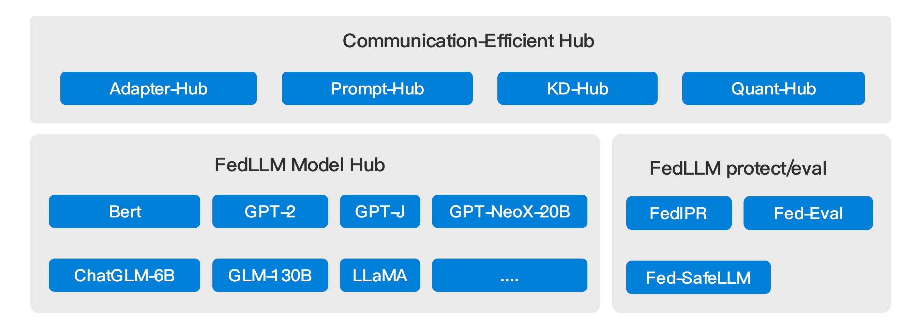
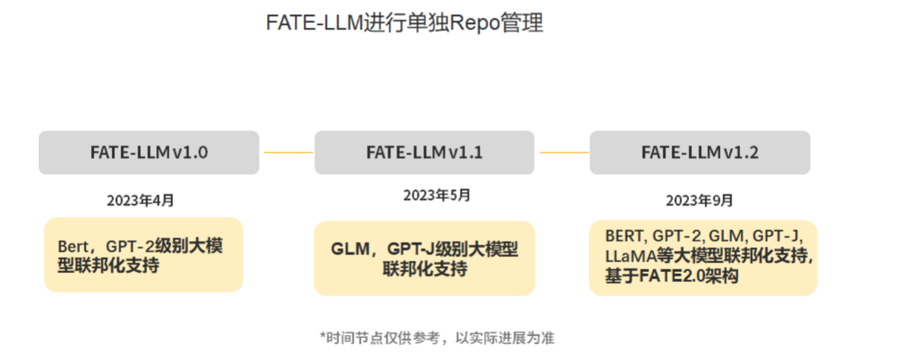

# Proposal: FATE-LLM will be in independent sub-repository

# Background #
 FATE-LLM is a new project for supporting federated learning for LLM. 

  

# Proposal #

We will use an independent sub-repository to manage FATE-LLM project.

# RoadMap #
The FATE-LLM project RoadMap is as following:

  

# Time #
2023/05