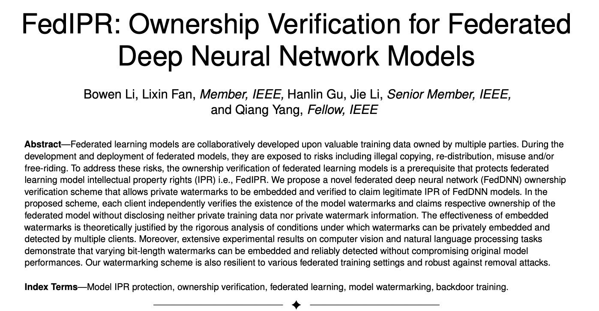
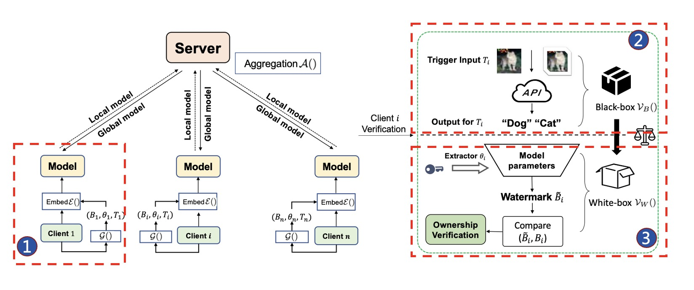
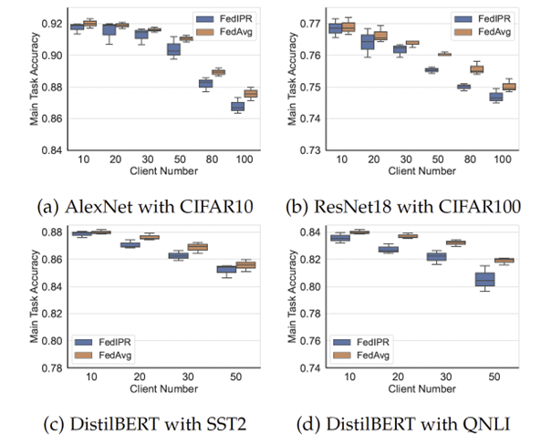
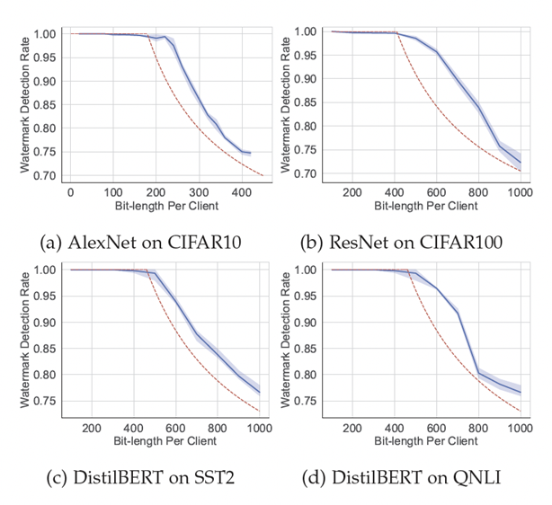

# Proposal: FedIPR: Federated Learning Model Ownership Verification
Author: <XingXing Tang, Hanlin Gu, Bowen Li, Lixin Fan>

Discussion: N/A

# Abstract #

This proposal proposes FedIPR([cite](https://ieeexplore.ieee.org/document/9847383/)), an ownership verification method to protect the intellectual property (IP) of Homogeneous Federated Deep Neural Network (FedDNN) for FATE.

# Background #
Machine learning, especially deep neural network (DNN) technology, has achieved great success in many fields in recent years, and many technology companies are deploying neural network models in commercial products to improve efficiency. Training advanced neural network models requires large-scale datasets, enormous computing resources, and the ingenuity of designers. This is embodied in: (1) The scale of the training model applied by the deep learning model is huge. Taking GPT-3 as an example, the amount of data used for pre-training reaches 45TB, and the training cost exceeds 12 million US dollars, which has a very high economic cost. (2) In the process of training and deploying deep learning models to industrial application scenarios (such as smart finance, smart medical applications), it is necessary to introduce proprietary prior knowledge in fields such as finance and medical care, so the knowledge and experience of experts need to be introduced in the model design process to customize the model, which reflects the intellectual property of human brain power. (3) The training process of deep learning models requires massive data in specific fields as training resources, and there are data values and knowledge attributes. The above properties determine that the trained deep learning model has high commercial value and intellectual properties, which must be included in the intellectual property of the legal owner (ie the party that created it). Therefore, there is an urgent technical need to protect deep neural network (DNN) models from illegal copying, redistribution, or misuse.

For expensive artificial intelligence models, attackers can use technical means or non-technical means to steal; but to confirm the theft and declare model ownership , it is completely from the perspective of artificial intelligence theory and methods, and the model's ownership authentication technology needs to be Guaranteed to provide a reliable and robust method of intellectual property protection without sacrificing model usability.

Unlike model training in centralized scenarios, distributed training of federated learning involves multiple participants, and there is a greater risk of leaking artificial intelligence models. There are situations where participants are attacked by adversaries or the model free-riders. These situations constitute a violation of ownership of the federated learning model.

In response to the copyright protection of the global model of federated learning, WeBank AI Lab and Shanghai Jiaotong University published an article on IEEE Transactions on Pattern Analysis and Machine Intelligence , a top academic journal of artificial intelligence([cite](https://ieeexplore.ieee.org/document/9847383/)) presented a paper titled " FedIPR : Ownership Verification for Federated Deep Neural Network Models " , and shared their thoughts on the protection of intellectual property rights of models from the perspectives of algorithms, protocols, security, etc. on the issue of intellectual property protection of federated learning models and work, a proposal named FedIPR The federated learning model copyright protection framework. 

  

# Proposal #

The architecture of the proposed FedIPR as flow:

  

Figure 2: FedIPR Architecture

Along with the training and distributing of the Federated Learning model, the functions of FedIPR are divided into two parts: the training part and the distributing part.
1) In the training part, Fig.2 (①), we need to implement three functions:
   1) __Black-box embedding function__: In this function, each client embeds its private trigger set from the client side, and we need to implement a loss (Backdoor loss)([cite](https://ieeexplore.ieee.org/document/9847383/)) to train the trigger set. 
   2) __White-box embedding function__: In this function, each client embeds its private watermark into the normalization layers, and we also need to implement the loss (Sign loss)([cite](https://ieeexplore.ieee.org/document/9847383/)) to let the private watermark embed to the Federated model successfully in the training stage.
   3) __Watermark verification function__: To allow the user to verify if the watermarks have been embedded successfully.
2) In the distributing part, we need to implement two functions:
   1) __Black-box verification function__ Fig. 2 (②): This function is not needed to access model parameters and internal structures, so we do not need to provide additional APIs, and users can verify through the general inference API using the own trigger dataset. 
   2) __White-box verification function__ Fig. 2 (③): We need to implement an API for users to open the model parameters and structure and verify whether the model parameters are embedded with a given "watermark".
   

# Non-Goals #
[Anything explicitly not covered by the proposed change.]

# Rationale #
The empirical study of the proposed FedIPR in terms of fidelity, significance and robustness of watermarks. Superior detection performances of both backdoor-based watermarks and feature-based watermarks demonstrated that this proposal provides a reliable and robust scheme for FedDNN ownership verification.

  

Fidelity: main task accuracy of FedDNN model with FedIPR

  

Significance: Watermark detection rate of FedDNN model with FedIPR compared to theoretical bound.

  

# Compatibility #
[A discussion of any compatibility issues that need to be considered]
# Implementation #
The Pytorch version of FedIPR has been released to the FederatedAI research repository in August 2022.

FedIPR will be implemented by WebankAI research team and FATE team.

FedIPR is planned to be released with FATE 1.11.
# Open issues (if applicable) #

N/A