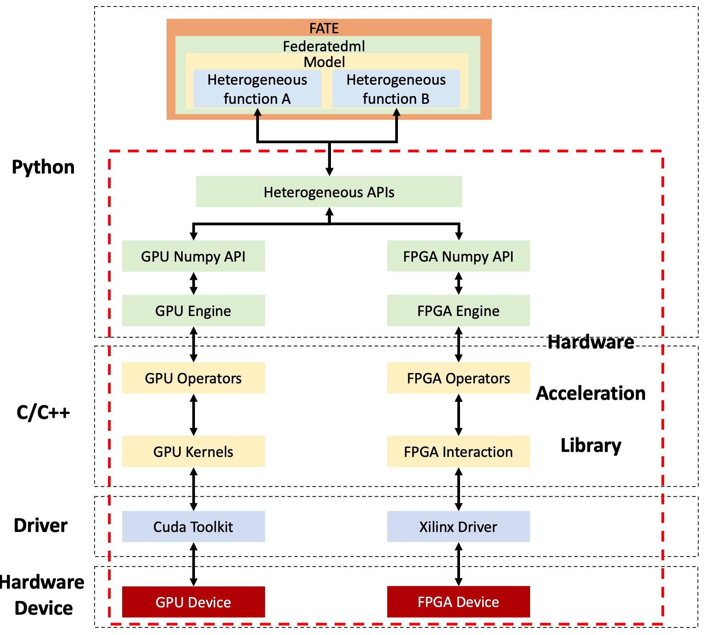

# Proposal: Hardware Accleration Support
Author: <[Junxue ZHANG](https://github.com/snowzjx), Junhuan SUN, Bin ZHAO>

Discussion: N/A

# Abstract #
This proposal intends to allow FATE to leverage hardware-based accelerators, such as GPU/FPGA, for better performance.

This proposal will contribute a universal architecture for FATE to use these hardware-based accelerators, including APIs, memory layout standards, data structure, and so on.

This proposal mainly targets accelerating cryptographic operations, such as Paillier encryption, ciphertext computation, and so on.

# Background #
In FATE, various cryptographic operations have been used to protect data privacy. Specifically, they are:  

1. Paillier Encryption w/ Obfuscation.

2. Paillier Encryption w/o Obfuscation.

3. Paillier Decryption.

4. Ciphertext Matrix Addition.

5. Ciphertext & Cleartext Matrix Element-wise Multiplication.

6. Ciphertext & Cleartext Matrix Multiplication.

7. Ciphertext Matrix Summation.

8. RSA Encryption/Decryption.

9. RSA Blind.

10. RSA Unblind.

Although preserving data privacy, these cryptographic operations also cause a dramatic performance penalty. In our experiment, these cryptographic operations cause >~80% total time when executing an end-to-end application. Thus, if we can efficiently accelerate these cryptographic operations, the end-to-end performance of FATE could be significantly improved.

# Proposal #
The architecture of our proposal is shown as follows and we mainly introduce the most important two parts: hardware acceleration library and heterogenous calculation functions.

## Hardware Acceleration Library ##
The acceleration library is a well-developed SDK which implements ciphergraphic operations mentioned above with different hardware, including GPU, FPGA, etc. The library is usually developed with Python and C/C++ language and provides several Python APIs for different operations. Once an API is called, it receives the input data (like ciphertext, keys, ciphertext bitwidth, batch size and target device) and sends them to the hardware devices. The devices are then invoked to execute corresponding operations. After calculation, the output data is sent back or stored in destination memory address by the library. 

In addition to the computing operations, the library is also responsible for data format conversion, data transmission and cross-language binding.

__Data format conversion__: Data preprocessing is required to reconstruct datasets for efficient batch processing on heterogeneous device. In data conversion API, raw data is loaded from database and the features and labels which come from the same mini-batch are densely packed together in an array-like architecture.

After aggregation, serialization is performed to convert data format. In order to optimize the performance of heterogeneous device and fully utilize cross-device interface like PCIe, data structure should be converted into byte stream before it is sent.

__Data transmission__: As the data format has been converted for better efficiency, data transmission between different parties for the new data format should also be introduced to reduce redundant data conversion. The \__getstate__ and \__setstate__ functions are overloaded to achieve automatic format processing during data transmission.

__Cross-language binding__: To efficiently invoke heterogeneous devices, the interactions with the devices are usually implemented by languages like C++. Therefore, it is required to bind between C++ and Python. Cross-language binding is leveraged in almost every API.

## Heterogenous calculation functions ##
The heterogeneous calculation functions are used to replace vallina functions in federatedml. In a training model like Hetero-LR, the functions with high computing capacity, like gradient computing, need to be replaced in order to achieve high throughput.

The normal workflow for a heterogeneous function is as follows.

__Data Preprocessing__: Before calculation, the data format conversion API should be called to convert all the source data into the format that can be directly handled by heterogeneous device.

__Calculation Operations__: The preprocessed input data is then fed into calculation APIs to execute corresponding computing.

__Data Conversion or Postprocessing__: 
When all the calculations are completed, the output data is either sent to another party or deserialized for subsequent operations in Federateml, such as the recovery of overall gradient obtained after decryption.

## Other changes ##
__Interoperation__: To further extend the compatibility of heterogeneous acceleration,  data format conversion before data transmission from server to hardware device is necessary. There should be some more attributes in the transfer class to indicate that these variables need to be converted before transmission if the job is processed between heterogeneous FATE and vallina FATE. 

__New Training Parameters__: To allow the users to conveniently choose the acceleration device or activate interoperability, some parameters should be added for the user to specify the target device and training mode (interoperation or not). These parameters are checked at the very begining of a training module and determine the APIs and functions to be called.

# Non-Goals #
[Anything explicitly not covered by the proposed change.]

# Rationale #
[A discussion of alternative approaches and the trade-offs, advantages, and disadvantages of the specified approach.]

# Compatibility #
[A discussion of any compatibility issues that need to be considered]

# Implementation #
[A description of the steps in the implementation, who will do them, and when.]

# Open issues (if applicable) #

N/A