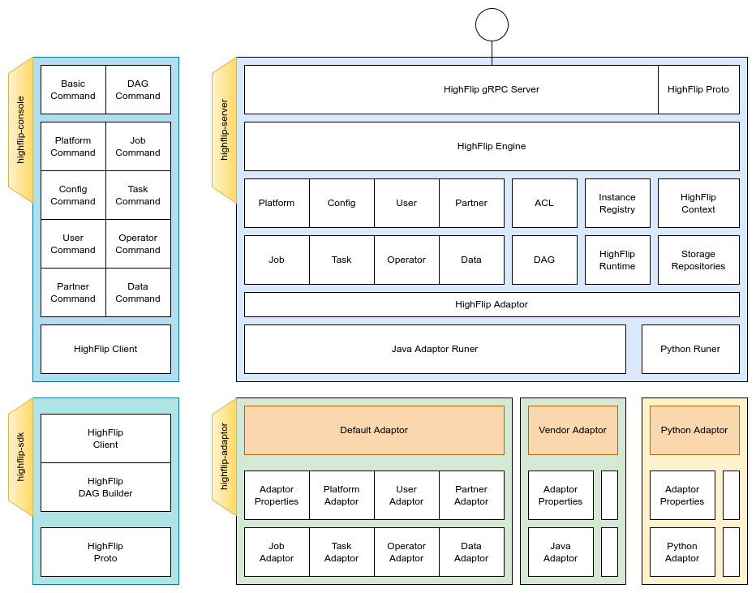

# HIGHFLIP Fate Adatper Proposal

Author: Chen Zhiyu

Discussion: N/A

Issue:  N/A

## 1.HIGHFLIP Introduction
HIGHFLIP is a **high**-layer (white box) **f**ederated **l**earning **i**ntercommunication **p**rotocol, which intends to build a unified upper-layer access interface for heterogeneous federated learning platforms, shield the internal implementation differences of federated learning platforms, and achieve unified control of nodes of different platforms. The java implemented version of HIGHFLIP is already published on github with Apache 2.0 License, and source code can be accessed from https://github.com/baidu/highflip.

HIGHFLIP can be applied in two scenarios: proxy scenario and extension scenario，which is relying on unified interface access capability.
- In the proxy scenario, by controlling a node that is deployed on the same type as the other party, it communicates with the heterogeneous counterpart federated learning platform node, so as to achieve the federated modeling capability with heterogeneous platforms.  
- In the extended scenario, expand the capabilities of existing platforms, integrate the operator functions of multiple platforms, and use them in one job.

THE HIGHFLIP server is daynamically extensible plugin system, and it's plugin named adapter. Any federated learning platform manufacturer can write adapter used by highflip server to provide an industry-recognized interface.

## 2.Why adapt HIGHFLIP
FATE adaptation can realize the intercommunication capabilities for other three-party platforms with their own engines and platforms based on the FATE engine. When the HIGHFLIP adaptation work is completed, FATE will have an unified top-level intercommunication access interface HIGHFLIP. If other manufacturers need to interoperate with FATE, they can use the HIGHFLIP protocol to apply proxy scenarios and control a local FATE engine to assist the three parties' own platforms to complete the upper-level operation requirements. When HIGHFLIP becomes a unified interface for all federated learning platforms to access, third-party platforms intercommunicate with other adapted HIGHFLIP platforms without requiring additional transformation, because they can reuse the same method.

FATE adaptation can combine FATE's capabilities with other manufacturers' engines, and further expand the application scenarios of FATE, not only limited to platforms that use the FATE engine. When the HIGHFLIP adaptation work is completed, by expanding the scenario, the workflow of other manufacturers will be able to include the operator components not only from their own platform but also from FATE, and corporately complete a federated learning job.

## 3.Adaptation description
Adapter refers to the HIGHFLIP adapter plug-in, which implements the driving logic for interacting with the platform interfaces of different manufacturers. The plug-in can be dynamically loaded by the HIGHFLIP service. HIGHFLIP provides the definition of the adaptation interface. Manufacturers can implement the corresponding driver functions according to the definition in the interface, and register the implementation class in the HIGHFLIP system to complete the adaptation work. When the HIGHFLIP service receives an external HIGHFLIP request, it will call the driver logic registered in the system according to the content of the request to complete the corresponding platform operation capabilities.

HIGHFLIP's Adapter provides a variety of adaptation interface types according to the adaptation function, namely: Platform, Job, Task, Data, Operator, Partner, Config, etc. Adaptation manufacturers can choose to fully adapt or partially adapt according to their own conditions. If there is no adaptation, the default adapter inside the system will be used to complete the corresponding function.

The adaptation to FATE will be completed in multiple stages:

- Stage 1: Minimal Subset Adaptation. That is, only the necessary functions of Job, Task, Data, and Operator are supported, and the Operator part only included Reader/Writer, Secure XGBoost, and PSI. This stage is mainly for FATE 1.9.0 and above version to carry out the adaptation work.

- Stage 2: Full Function Adaptation. That is to say, the FATE capability is fully exposed to the HIGHFLIP interface, and other callers can fully operate the FATE function through the HIGHFLIP interface.

Project will create a seperated repository in FederatedAI org, and named “highflip-fate-adapter”.
The output of adapter is used by HIGHFLIP server project, and FATE is accessed by it.
