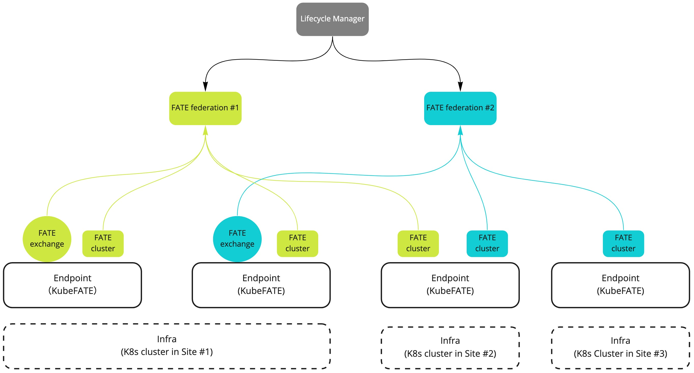
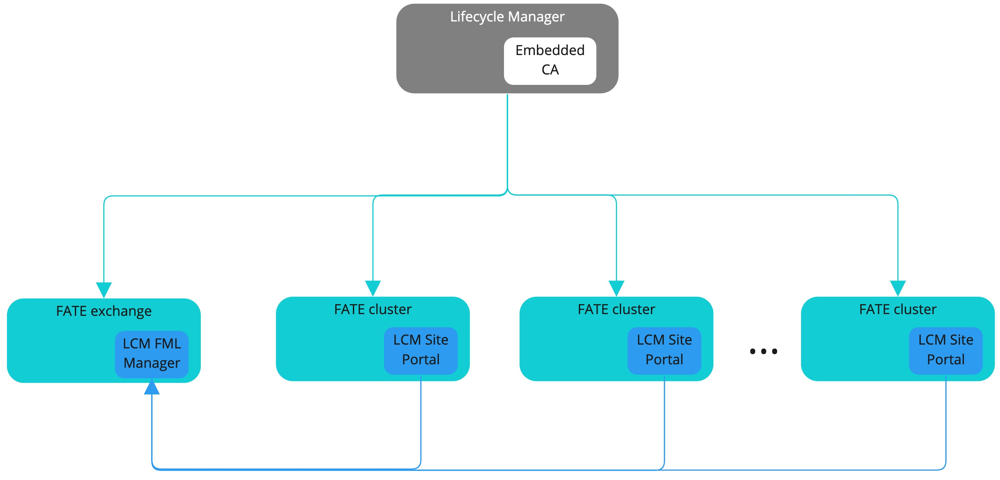

# Proposal: New Lifecycle Manager project to manage FATE federations #
Author: Fangchi Wang (wfangchi), Layne Peng (LaynePeng)

Discussion: N/A

Issue: [FATE-Community/issues/45](https://github.com/FederatedAI/FATE-Community/issues/45)

# Abstract #
This proposal describes a web-based solution - Lifecycle Manager - to manage FATE deployments from a federation perspective. Using this solution, a user can easily set up FATE federations by deploying services like FATE exchange, FATEFlow as well as other core components, and configuring the route tables in all the parties so that they can form a federation where federated learning job can be launched among them. Other than deploying, this project contains other lifecycle management functionalities like monitoring, upgrading, uninstalling, site management and so on.

# Background #

Currently, we have KubeFATE, and Ansible ways to deploy the FATE cluster on one site. But we lack the federation level provision and management solution. We often meet with questions like how to connect and orchestrate sites for a global security and governance restriction as a federation?

Furthermore, current deployment solutions (including KubeFATE and Ansible) are CLI-based, which is still an overstretched requirement for infrastructure knowledge. An easier use deployment solution is apparently preferred.

# Proposal #
We are proposing a new project, Lifecycle Manager, to fulfill this requirement. The main component of this project is a web service that helps user to manage FATE federation via a graphical interface. This service will leverage other projects like KubeFATE and/or Ansible to perform the FATE deployment in different party. And automatically configure the route table so the parties can find each other.

The overall architecture is shown in below diagram. On the top is our proposed Lifecycle Manager service, and it manages the following entities:

* Infrastructure Provider - a representation of a connection to an underlying infra resource, such as a K8s cluster, a single machine/VM or a device.
* Endpoint - a service running on Infrastructure that lifecycle can act on, e.g. KubeFATE. It manages the FATE installation in one site locally.
* Federation - a federated learning network where multiple FML participants have joined. This is a logic component and the top-level entity on which users work.
* FML participant - an entity of a federation. This could be a FATE exchange or FATE cluster.

It is designed with such flexibility so that we can support multiple federations, different kinds of infra, endpoints etc. And participant can have the capability of being deployed on any of them. There are a few more entities that is associated with the above core entities and will be used for the whole lifecycle management workflow.

* Chart - self-managed helm charts for deploying FATE participants
* Event - event record of the related entity
* Certificate - certificates issued for some of the services in FATE deployment that needs TLS.

Besides these, Some additional services can also be deployed, including an embedded CA service that can be used to issue certificates, and a site management service which will be running alongside the FATE instance in each party to help facilitate the site federated machine learning management. This is an additional service that adds FATE job/model/data management support via a web UI and can accelerate the whole FML workflow around FATE, as highlighted in below diagram:

# Non-Goals #
This project is not introducing a new single-party deployment method in parallel with projects like KubeFATE and AnsibleFATE. Rather, this project relies on these projects to support managing FATE federations - that is working with multiple parties from this service.

# Rationale #
As mentioned above, currently there is no FATE lifecycle management solutions from a "Federation" level. Each party needs to deploy its own FATE instance themselves and configure the route table separately.

# Compatibility #
The Lifecycle Manager should try to support deploying the currently supported FATE releases. And try to keep up the same release cadence as FATE.

# Implementation #
We will implement the first version of the service, including frontend UI and backend, that supports the following configurations:
1. Support managing Kubernetes as Infrastructures.
2. Support deploying and managing KubeFATE as Endpoints.
3. Support creating FATE federation.
4. Support deploying FATE v1.8.0 exchange and clusters and configuring related route tables, using spark + pulsar as the backend engines.
5. Support issuing certificates for services like pulsar, site management portal, etc.
6. Scripts and documents to deploy the service in a Kubernetes cluster or via the docker-compose approach.

# Open issues (if applicable) #
N/A.
