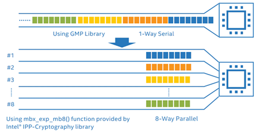

# Proposal: Accelerated Paillier cryptosystem scheme on Intel AVX512/IFMA #
Author: Jingyi Jin, [Sejun Kim](https://github.com/skmono), [Xiaoran Fang](https://github.com/fangxiaoran)

Discussion: N/A

Issue: [FATE-Community/issues/3909](https://github.com/FederatedAI/FATE/issues/3909)

# Abstract #
Motivated by Intel's prior proof of concept success with WeBank, where the modular exponentiation operation is accelerated by up-to 4.7x using Intel [IPP-Crypto](https://github.com/intel/ipp-crypto) on AVX512/IFMA systems, Intel developed a new library called Intel Paillier Cryptosystem Library that wraps out the optimization techniques. IPCL is being reviewed for full compliance to the ISO/IEC 18033-6 standards, and planned to be released in Q2 2022.

The proposed feature is to integrate an accelerated version of Paillier cryptosystem on AVX512/IFMA enabled Intel systems, as an alternative to [fate_paillier](https://github.com/FederatedAI/FATE/blob/master/python/federatedml/secureprotol/fate_paillier.py).

# Background #
Prior work with WeBank increased confidence about using Intel IceLake CPUs to accelerate Paillier scheme. Key performance bottleneck is on Modular Exponentiation. This function can be accelerated using IFMA features AVX512 instruction set, and we can parallelize its computation using the SIMD features from AVX512, with packing the values in a size of 8 batch, as shown below.

<div style="text-align:center">

</div>

The overall speedup of multi-buffer modular exponentiation with IPP-Crypto compared to conventional implementation is up to 4.7x, in terms of throughput.

<div style="text-align:center">

</div>

Intel Paillier Cryptosystem Library is essentially composed with:

1. C++ backend: Primitive Paillier functionalites implemented with IPP-crypto, which automatically detects supported instruction sets of the system to enable multi-buffer modular exponentiation
2. IPCL Python: The Python extension module built with Python bindings of the C++ backend and wrapper for easier usage of the library.

# Proposal #
The figure below illustrates the structure of IPCL and how it is to be integrated to FATE.

<div style="text-align:center">

</div>

IPCL is to be offered as an alternative to FATE-Paillier by user selection.

# Rationale #
Advantages:

- Only known open-source Paillier scheme compliant to ISO/IEC 18033-6 standard
- Significant performance boost in encryption and decryption

Trade-offs:

- No performance gain in HE addition; further investigation is needed

# Compatibility #

- No support on Windows and MacOS; to be supported in future releases

# Implementation #
The implementation of IPCL Python module will be in-line with the existing [fate_paillier.py](https://github.com/FederatedAI/FATE/blob/master/python/federatedml/secureprotol/fate_paillier.py). Maintaining the consistency of the existing FATE code base will be the highest priority, as we elect to keep the class names of `fate_paillier.py` in IPCL Python. Our module will be regarded as an alternate option to `fate_paillier`.

## API ##
### IPCL Python function definition ###
To make IPCL Python to be interchangeable with existing `fate_paillier`, the 4 main class names will be the same, defined in the Python wrapper for IPCL C++ backend. The core functions of each class will retain the same name as much as possible.

| Class | Core function(s) |
| ---------- | ---------- |
| `PaillierKeypair` | `generate_keypair` (static) |
| `PaillierPublicKey` | `encrypt` |
| `PaillierPrivateKey` | `decrypt` |
| `PaillierEncryptedNumber` | `+`, `*` operators |

- `PaillierKeypair.generate_keypair`: Generates tuple of `PaillierPublicKey` and `PaillierPrivateKey`
- `PaillierPublicKey.encrypt`: Encrypts single (or `list`, `numpy.array`) `int`/`float` and returns single (or `list`) `PaillierEncryptedNumber` containing the ciphertext
- `PaillierPrivateKey.decrypt`: Takes single (or `list`) `PaillierEncryptedNumber` and returns single (or `list`) decrypted plaintext
- `PaillierEncryptedNumber` operators: Provides all four base arithmetic operators (ciphertext/plaintext addition/subtraction, plaintext multiplication/division)

### Utilizing more C++ features ###
While the base functionality is nearly the same, IPCL and IPCL-Python will be rely more on C++ based features than those on Python.

- C++ OpenMP: Due to the bottleneck of data exchange between Python integers and C++ IPP-Crypto `BigNumber`, we will use OpenMP over Python `multiprocessing`, which becomes an overhead during serialization/deserialzation of IPCL C++ objects
- Packed Ciphertext: Unlike conventional `fate_paillier` where encryption/decryption and HE operations are handled based on single values, IPCL-Python will use packed ciphertexts. Whatever the input, `encrypt` will return a single `PaillierEncryptedNumber` containing all the ciphertexts.

```Python
x = np.random.rand(1000)
ct_x = pubkey.encrypt(x)  # returns single PaillierEncryptedNumber containing all the ciphertext of encrypted x
dt_x = prikey.decrypt(ct_x)  # return list of decrypted numbers of ct_x
print(np.allclose(x, dt_x))  # will return True
```

- Additional math functions support: As ciphertexts will be packed into single `PaillierEncryptedNumber` object, `PaillierEncryptedNumber` will support additional functions

| Function name | Description |
| ------------- | ----------- |
| `sum`/`mean` | Return sum/mean of all packed ciphertext |
| `dot` | Returns dot product with plaintext array/list |
| broadcasting | addition and multiplication both will support broadcasting natively (for scalar input) |

### Release and Distribution ###
We plan to release IPCL and IPCL-Python open-source via **github** by end of Q2 2022. Following the release, we will upload IPCL-Python to **Python Package Index** for easier distribution.

### Continued support ###
Initially, IPCL-Python is focused on acceleration on AVX512/IFMA based systems, we will continue expanding features to work on upcoming Intel technologies. We will also continue to support non-AVX512/IFMA systems, and address any issues/suggestions.

# Open issues (if applicable) #
N/A
