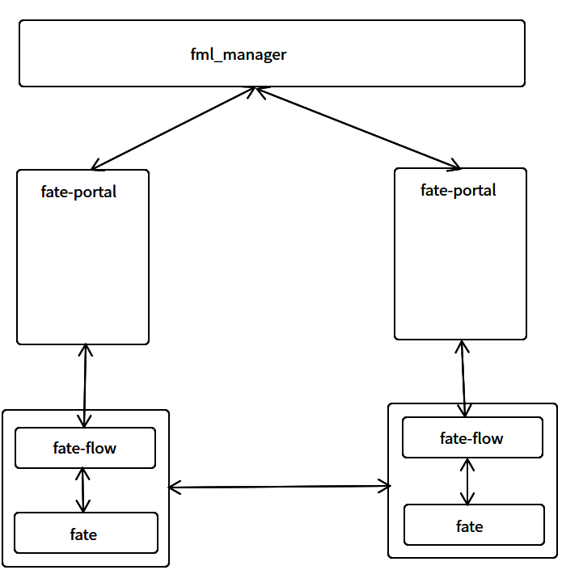

# Proposal: Visual modeling management side #
Author: zhangyifei、liuyuliang
Discussion: N/A
Issue: [FATE/issues/3893](https://github.com/FederatedAI/FATE/issues/3893)

# Abstract #
This proposal describes a visual modeling manager based on Java and Vue implementation, which enables users to use FATE algorithms for federated modeling by dragging and dropping flow charts. In addition, the project also includes other management functions, such as participant management, data source management, training task management, model management, forecasting, modeling process results viewing, etc
# Background #
Is rich in the FATE of the learning algorithm, can support a variety of federal model training, but for the user's entry is higher, are not so friendly to the user experience, we are always in the process of training to adjust model parameters so that the observation model are the training results meet expectations, with the introduction of the visualized modeling process of drag drag type, Support the independent operation of each algorithm and result confirmation in the process of modeling, and facilitate the management of each participant, clear the use of data samples, to ensure that data samples are not abused, reduce the access threshold of users, and optimize user experience.

# Proposal #
Our suggestion is to achieve this by creating a Portal project, which is a web service implemented based on Java and Vue, which can help users use various machine learning algorithms in FATE by dragging and dropping flowcharts. The project is deployed in different users through docker deployment, and by registering local service information to the central management node fml_manager, it is convenient for each participant to find the required partner.
The overall structure diagram is as follows:

The central management node fml_manager depends on https://github.com/FederatedAI/FedLCM/tree/main/fml-manager
It encapsulates the algorithm in FATE into an independent visual drag-and-drop component, and provides the page required for the component to configure hyperparameters, changing the modules and parameters required in the FATE task from JSON configuration to DAG flowchart configuration.
It parses the components of the DAG flow chart in the UI, automatically generates the DSL and CONF parameters required for FATE task operation, interacts with FATE through fate-flow, submits tasks, executes status queries, etc.
It makes all the algorithms and hyperparameters of the algorithms in FATE configurable, which means that if FATE adds or modifies algorithms or hyperparameters, it will not need to be redeployed, but only need to maintain the parameters.

# Non-Goals #
This project relies on the fml_manager module of FedLCM in FATE to discover the parties.

# Rationale #
N/A

# Compatibility #
The fate-portal should try to support deploying the currently supported FATE releases. And try to keep up the same release cadence as FATE.
The current version only supports FATE1.x

# Implementation #
We will implement the first version of the service, including the front UI and back end, supporting the following:

1. Support participant management, including registration, discovery, signing, etc

2. Support data sample management, including self-owned data samples and data samples of partners

3. Support visual modeling, including algorithm component list, drag canvas, component parameter configuration, etc

4. Support data sample uploading, intersection, standardization, feature screening, vertical logistic regression and other algorithms in FATE.

# Open issues (if applicable) #
N/A
